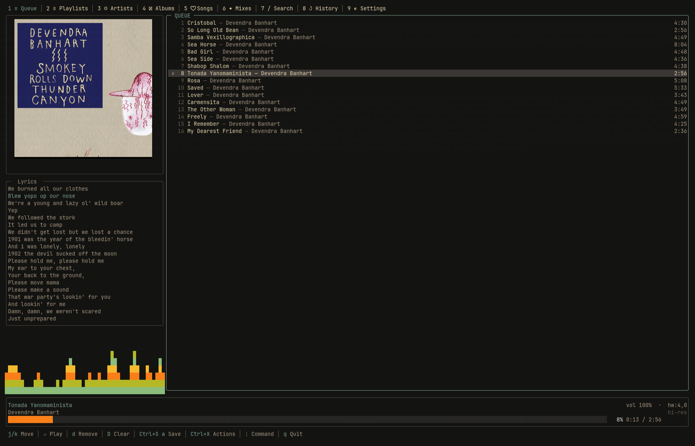

**goTidal** is a Tidal music player for Linux that delivers **bit-perfect, lossless audio — up to 192 kHz / 24-bit hi-res** — straight to your DAC: no PipeWire, no PulseAudio, no resampling. No DAC? **PipeWire mode** is one toggle away (Settings tab or command palette).

It runs three ways, all sharing the same playback engine:

- **Interactive TUI** — browse, search and control playback from the terminal
- **Daemon** — headless background process, controlled via the TUI or any MPRIS2 client
- **Client** — lightweight TUI that forwards commands to a running daemon over D-Bus

The daemon holds the audio device only while a track is actually playing, releasing it on pause.

> 100% vibe coded with [Claude](https://claude.ai) — grown out of an earlier player called tidalt, renamed and extended into goTidal.

**Linux only.** Requires a Tidal HiFi or HiFi Plus subscription.

---

## Audio quality

goTidal asks for the best tier your subscription allows and walks down the ladder until one is granted:

| Tier | What you get | Badge |
| ---- | ------------ | ----- |
| `HI_RES_LOSSLESS` | FLAC up to 192 kHz / 24-bit | `hi-res` — violet at 176.4/192 kHz, green at 88.2/96 kHz |
| `LOSSLESS` | FLAC 44.1 kHz / 16-bit (CD) | `lossless` |
| `HIGH` / `LOW` | lossy AAC | `(lossy)`, in red |

The badge reflects **what actually reached the device**, read back from the opened ALSA endpoint — not what was requested.

Hi-res tracks aren't served as a single file: Tidal returns an MPEG-DASH manifest, and goTidal fetches the segments in order and feeds them to the decoder as one continuous stream, reading ahead so a segment boundary never starves the DAC. Seeking is segment-aligned.

Output goes to the ALSA `hw:` device directly, with the stream's native rate and format negotiated via `snd_pcm_hw_params` and no soft resampling. Two things take you off that path, both visible in the UI: **PipeWire mode** (your choice), and the `plughw:` fallback for [fixed-format interfaces](#fixed-format-audio-interfaces), which marks the badge `(converted)`. **Data Saver** (command palette) is the deliberate opposite — PipeWire plus a lossy tier, for metered connections.

---

## Features

- **rmpc-style tab bar** — Queue, Playlists, Artists, Albums, Songs, Mixes, Search, History, Settings (`1`-`9`). Keybindings follow [rmpc](https://github.com/mierak/rmpc) throughout
- **Album art, spectrum, lyrics** — a true-square cover panel (Kitty graphics, Sixel, or Unicode block-art), a live [`cava`](https://github.com/karlstav/cava) spectrum strip or built-in peak meter, and synced lyrics from [LRCLIB](https://lrclib.net)
- **Action sheet** (`Ctrl+X`) and **command palette** (`:`) for everything else
- **Hybrid queue / playlist model** — opening a playlist loads it *and remembers where it came from*; the header shows `synced` or `edited`. Editing the queue never silently rewrites the playlist behind it
- **Full playlist management** — create, append, and delete (behind a confirmation) without leaving the TUI
- **Grouped search**, **favorites** as their own tabs, **artist discography**, **Daily Mixes**, **song radio**, and **history**
- **[Import from Spotify](docs/spotify-import.md)** — paste a track or playlist URL; goTidal matches each song on Tidal. No Spotify login needed
- **Ten colour themes** plus *Auto — match terminal*, with live preview
- **Gapless playback**, optional CD-recorder silence gap, **MPRIS2** media keys, and session/position restored on next launch

See [docs/ui.md](docs/ui.md) for a full tour of the interface.

---

## Install

Pre-built packages are on the [releases page](https://github.com/carcuevas/gotidal/releases).

```bash
sudo pacman -U gotidal-*.pkg.tar.zst          # Arch
sudo dpkg -i gotidal_*.deb && sudo apt-get -f install   # Debian / Ubuntu
sudo dnf install gotidal-*.rpm                # Fedora
```

Then register the `tidal://` URL handler (so "Open in desktop app" on tidal.com
opens goTidal), and optionally install it as a systemd user service:

```bash
gotidal setup
gotidal setup --daemon
```

On first run you'll log in via the Tidal OAuth2 device flow. The session is
saved to the system keychain, or an age-encrypted file at
`~/.config/gotidal/secrets`.

[docs/installation.md](docs/installation.md) covers building from source and
building the distro packages yourself.

---

## Keybindings

Press `?` in the app for the same reference.

| Key | Action |
| --- | ------ |
| `1`-`9`, `Tab`/`Shift+Tab`, `gt`/`gT` | Switch tabs |
| `j`/`k`, `gg`/`G`, `Ctrl+u`/`d`, `Ctrl+b`/`f` | Move, top/bottom, half-page, page |
| `Enter` / `Esc` | Open, play, confirm / close, go back |
| `p` / `s` | Play-pause / stop |
| `f` / `b` | Seek ±10 seconds |
| `>` / `<` | Next / previous track |
| `.` / `,` | Volume ±5% |
| `a` / `A` | Add to queue — track, album, playlist or mix under the cursor / everything visible |
| `d` / `D` | Remove from queue / clear queue — on the Playlists tab, `d` deletes the playlist (confirms first) |
| `K` / `J` | Move a queue item up / down |
| `x` / `X` | Toggle shuffle / reshuffle |
| `Ctrl+S` | Save the queue as a new playlist (prompts for a name) |
| `F` / `i` | Favorite the selected track / whatever is under the cursor (track, album or artist) |
| `r` / `y` | Radio from the selection / copy Tidal link |
| `v` | Switch the meter between peak and CAVA spectrum |
| `Ctrl+X` / `:` / `/` | Action sheet / command palette / search |
| `oo` / `oI` | Output device selector / current-song info |
| `?` / `q` | Keybinding reference / quit |

Themes live on the Settings tab: `t` cycles them, and the Themes row opens the full picker.

### Media keys

With the daemon running (`gotidal setup --daemon`), goTidal registers as an
MPRIS2 player, so media keys, `playerctl` and KDE Connect all work with no TUI
open. A plain TUI session does not register a persistent MPRIS2 service. See
[docs/media-keys.md](docs/media-keys.md).

---

## DACs

Auto-detection scans `/proc/asound/cards`; the Hidizs S9 Pro, S9 Pro Plus
("Martha") and Focusrite Scarlett Solo are recognised by name. Any other
ALSA-visible device can be selected manually with `oo`.

### Fixed-format audio interfaces

Most DACs let goTidal negotiate the stream's native shape on the `hw:`
endpoint, which is what makes bit-perfect output possible. A few USB interfaces
— Focusrite's Vocaster line, for example — expose a *fixed* format and reject
anything else. goTidal then reopens the device through `plughw:`, which
resamples to whatever the hardware accepts: playback works, but is **no longer
bit-perfect**, and the badge says `(converted)`.

This only engages on a genuine format refusal. Transient failures (PipeWire not
having finished releasing the device, say) are retried against `hw:`, so a
capable device is never silently downgraded.

---

## Data & storage

| What | Where |
| ---- | ----- |
| OAuth2 session | System keychain, or `~/.config/gotidal/secrets` (age-encrypted) |
| Volume, device, queue, history, caches | `~/.local/share/gotidal/gotidal-cache.db` |
| Debug logs | `~/.local/share/gotidal/gotidal-*.log` (rotated) |

---

## License

goTidal is licensed under the **[Apache License, Version 2.0](LICENSE)**, and is
a fork of [Benehiko/tidalt](https://github.com/Benehiko/tidalt) (also
Apache-2.0); files have been modified from the original — see [NOTICE](NOTICE).

Two features talk to third-party software at runtime, neither bundled nor
linked into goTidal: the visualizer invokes the system's
**[`cava`](https://github.com/karlstav/cava)** binary (GPL-3.0) as an optional
subprocess, and synced lyrics come from the public
**[LRCLIB](https://lrclib.net)** API. Sixel encoding *is* compiled in —
**[mattn/go-sixel](https://github.com/mattn/go-sixel)** and
**[soniakeys/quant](https://github.com/soniakeys/quant)**, both MIT, vendored
with their `LICENSE` files intact.

---

## Further reading

- [Installation](docs/installation.md) · [Development](docs/development.md)
- [Architecture & audio pipeline](docs/architecture.md) · [DAC compatibility](docs/dac-compatibility.md)
- [UI tour](docs/ui.md) · [Synced lyrics](docs/lyrics.md) · [Spotify import](docs/spotify-import.md)
- [Daemon & client mode](docs/client-server.md) · [MPRIS2](docs/mpris2.md) · [Media keys](docs/media-keys.md)
- [Browser URL handler](docs/browser-url-handler.md) · [Debugging](docs/debugging.md)
