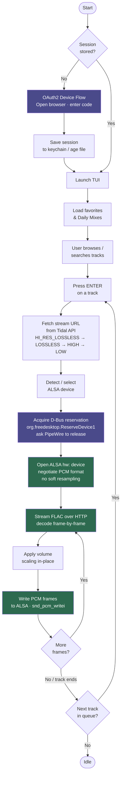

# Architecture

## How it works

## Audio pipeline

1. **Stream URL** — The Tidal API is queried for a FLAC stream URL, trying quality tiers from highest to lowest (`HI_RES_LOSSLESS`, `LOSSLESS`, `HIGH`, `LOW`).
2. **FLAC decode** — Frames are decoded in-flight from the HTTP response body using `github.com/mewkiz/flac`. No temporary files, no buffering to disk.
3. **Format negotiation** — The ALSA `hw:` device is opened with the low-level `snd_pcm_hw_params` API (not the convenience wrapper). For 16-bit sources the preference order is `S16_LE → S24_3LE → S24_LE → S32_LE`; for 24-bit sources `S24_3LE → S24_LE → S32_LE`. Soft resampling is disabled — the sample rate must match the stream exactly.
   - **`plughw:` fallback** — Some USB interfaces (e.g. Focusrite's Vocaster line) expose a fixed native channel count, rate, and format on their `hw:` endpoint and refuse anything else. Because the C helper splits `open_hw_device` from `configure_hw_pcm`, this refusal is distinguishable from a device that is merely busy: only a `configure_hw_pcm` failure (tagged `errFormatRefused`) retries through ALSA's plug layer, which resamples and remixes to the hardware's shape. This forfeits bit-perfect output, so `alsaHandle.bitPerfect` is set false and surfaced through `Player.AudioPath` to the now-playing bar, which then shows the `plughw:` device and marks the quality badge `(converted)`. A busy device fails at the open step instead, keeps the existing `-EBUSY` retry against `hw:`, and is never downgraded. The result is memoised per device so pause/resume and gapless transitions skip the known-failing `hw:` open.
4. **PCM packing** — Samples are packed into the negotiated format with correct sign extension before being written to ALSA.
5. **Xrun recovery** — Buffer underruns are recovered automatically via `snd_pcm_recover`.
6. **PipeWire handoff** — Before opening the `hw:` device, the app acquires `org.freedesktop.ReserveDevice1.Audio{N}` on D-Bus. If PipeWire currently owns the device it is asked to release via `RequestRelease`. The reservation is held for the duration of playback and released on stop.
7. **CAVA tap (non-blocking, additive only)** — After each PCM buffer is packed and *before* it reaches `snd_pcm_writei`, a copy is offered to a small buffered channel (`Player.TapPCM`) via a non-blocking `select`. `internal/visualizer` drains that channel into a FIFO the real `cava` binary reads, for the Queue tab's spectrum strip. A slow or absent consumer only ever drops tap frames — this tee has no path back into the write to ALSA, so it cannot affect bit-perfect output.
8. **Inter-track silence gap (optional, off by default)** — At the gapless track-transition point, `writeSilence` can write N milliseconds of zero-valued PCM to the still-open ALSA handle before the next track's frames start, so a downstream CD/DAT recorder's own silence-based auto-track-detection has a real gap to key off. Toggled via the command palette (`Player.SetInterTrackSilenceMs`); it writes pure silence between tracks and never touches either track's own samples, so bit-perfectness is unaffected either way.

## Package overview

| Package | Description |
|---------|-------------|
| `cmd/gotidal` | Entry point. Subcommands: TUI, `daemon`, `play`, `setup`, `setup --daemon`. Session load/restore, OAuth2 device-flow login. |
| `internal/tidal` | Tidal API client. OAuth2 auth, token refresh, REST calls (favorites, search, stream URL, mixes, radio, artist albums/top-tracks/all-tracks). |
| `internal/player` | Bit-perfect playback via CGO. FFmpeg (libav*) demuxes/decodes the stream; libasound plays it. Direct ALSA `hw:` access, PCM format negotiation, `plughw:` fallback for fixed-format devices, PipeWire reservation, seek. |
| `internal/store` | Persistent storage. OAuth2 session in system keychain (falls back to age-encrypted file). Volume, device, position, theme, and track cache in bbolt. |
| `internal/ui` | BubbleTea TUI. An rmpc-style numbered tab bar + tab content: Queue (AlbumArt/Cava/Lyrics + track list), Playlists, Favorites (songs/artists/albums), Recently Played, Daily Mixes, Search, and Settings; overlays for the command palette, contextual action sheet, device select, help, song info, and add-to-playlist; a centralized palette/theme system with a live-preview picker; a hybrid queue/playlist model. Runs headless in daemon mode. See [ui.md](ui.md). |
| `internal/mpris` | MPRIS2 D-Bus server + client. Media-key commands, `io.gotidal.App` private interface for client↔server communication. |
| `internal/lyrics` | Synced-lyrics lookup against LRCLIB and LRC parsing. See [lyrics.md](lyrics.md). |
| `internal/visualizer` | Drives a real `cava` subprocess (FIFO input, ascii raw output) for the Queue tab's spectrum strip. Optional — a no-op when `cava` isn't installed. |

## Dependencies

| Library | Purpose |
|---------|---------|
| [charmbracelet/bubbletea](https://github.com/charmbracelet/bubbletea) | TUI framework |
| [charmbracelet/bubbles](https://github.com/charmbracelet/bubbles) | Progress bar, text input |
| [charmbracelet/lipgloss](https://github.com/charmbracelet/lipgloss) | Terminal styling |
| [godbus/dbus](https://github.com/godbus/dbus) | D-Bus (PipeWire reservation + MPRIS2) |
| [docker/secrets-engine](https://github.com/docker/secrets-engine) | Secure credential storage |
| [go.etcd.io/bbolt](https://go.etcd.io/bbolt) | Local settings & track metadata cache |
| libasound (CGO) | Direct ALSA `hw:` playback |
| FFmpeg — libavformat/libavcodec/libswresample (CGO) | Demux/decode the streamed audio (FLAC, AAC/mp4, ALAC) and resample to S32LE. Linked dynamically for local/dev builds; the official distro packages bundle a minimal static FFmpeg. |
| [cava](https://github.com/karlstav/cava) (optional, invoked as a subprocess) | Spectrum-visualizer FFT + smoothing for the Queue tab's Cava strip. Not linked or bundled — the Cava pane just shows a placeholder without it. |
| [LRCLIB](https://lrclib.net) (optional, HTTP API) | Synced-lyrics lookup for the Queue tab's Lyrics panel. |
| [mattn/go-sixel](https://github.com/mattn/go-sixel) | AlbumArt cover encoding for Sixel-capable, non-Kitty terminals (foot in particular — see `internal/ui/sixel.go`). |
